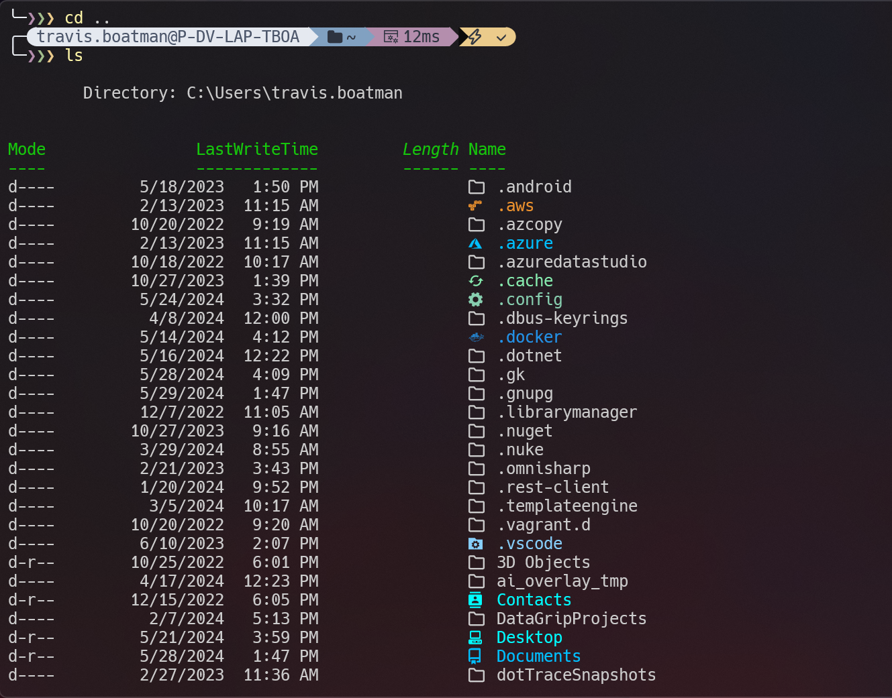
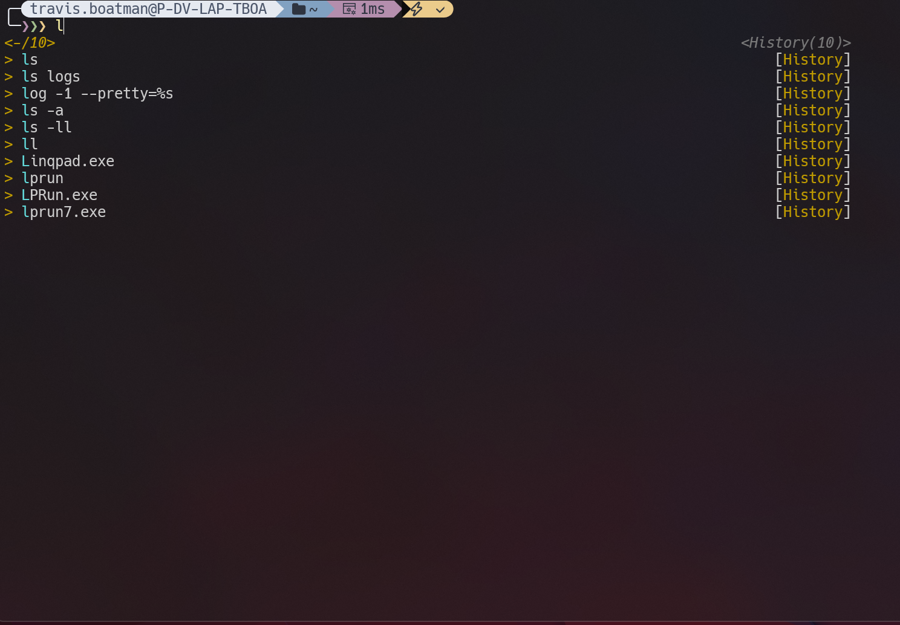

# Quill

Scripts I use on a daily basis.

This repository is used as a centralized location for my terminal setup across PCs.
For the most part anyone should be able to use them and use my custom theme and configs. Any paths used are agnostic. Environment varibles and configs are used where needed.

## Modules Used:
* Terminal Icons - Icons in your terminal.
* PSReadLine - Terminal command history.
* gsudoModule - sudo for Windows.

# Install
- Install a Nerd Font (https://github.com/ryanoasis/nerd-fonts)
- Run `./setup/install.ps1` on the terminal you want customized (works on PS 7+ and Win PS).

# Commands
* dto - Creates a private and public DTO event for you and your team.
* delete-fast - Fast delete a directory.
* go - Go to a directory.
* open - Open/Execute an app, file, url, path.
* reload - Reload terminal environment varibles.
* npm-creds - Sets a new NPM auth key.
* vm - Start, Stop, Save, Restart, Checkpoint Hyper-V VMs.

# Examples

## Open:

```json
{
    "mail":  "https://outlook.office.com/mail/inbox",
    "teams": "https://teams.microsoft.com",
    "vs":    "devenv",
    "jira":  "https://jira.mycompany.com/",
    "groups": {
        "code": ["vs", "jira"],
        "web": ["mail", "teams"]
    }
}
```

```console
open mail // Opens mail.
open mail, teams // Opens both mail and teams.
open code // Opens all in the group.
open code, web // Opens both groups.
```

## VM:

All VM commands require administrator permissions. If a VM name is not passed then the latest created VM is used.


```
sudo vm start // Starts the newest VM configured.
sudo vm start myVmName // Starts the VM called "myVmName".
sudo vm stop // Stops the latest configured VM.
```

# Additional Scripts

The directory `/additional-scripts` is used for scripts you don't want tracked by git.
These will also be automatically assigned an alias on their file name.

# Python Scripts

Additional scripts in python located under `/py-scripts`. These are not added automatically with an alias.

# Examples



